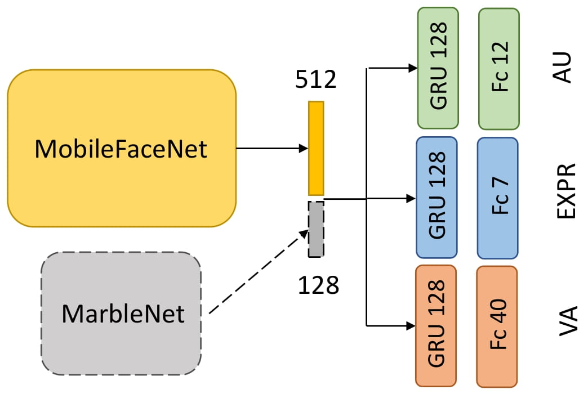
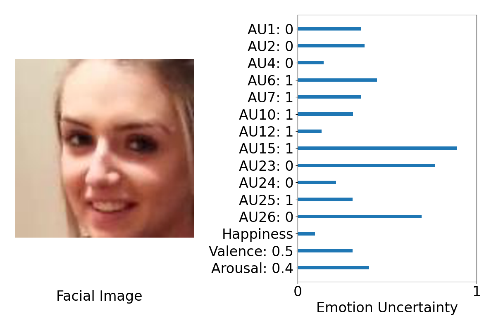

# Multitask Emotion Recognition with Uncertainty Prediction

This is a repository for our solution for the [ABAW2021 Challenge](https://ibug.doc.ic.ac.uk/resources/iccv-2021-2nd-abaw/). Our team name is NISL-2021. We have won the first place in the VA challenge track ([leaderboard](https://github.com/dkollias/ABAW2-Results/blob/main/abaw2_va_leaderboard.pdf)). The Valence CCC on the test set is 0.5326 and the Arousal CCC on the test set is 0.4537. 

# Three Emotion Descriptors

We trained unified models to predict three emotion descriptors, 

 - 12 facial action units, i.e., AU1, AU2, AU4, AU6, AU7, AU10, AU12, AU15, AU23, AU24, AU25, AU26

 - 7 basic emotions, i.e., neutral, anger, disgust, fear, happiness, sadness and surprise

 - continuous emotions: valence and arousal in the range [-1, 1].

# Models

Our models have efficient CNN-RNN architectures. We show the visual and visual-audio model architectures in this picture. The visual backbone is the [MobileFaceNet](https://arxiv.org/abs/1804.07573) and the audio backbone is the [MarbleNet](https://arxiv.org/abs/2010.13886).



We list the number of parameters of our visual model (EMENet-V) and visual-audio model (EMENet-VA) as follows:

| Model | # Param. | FLOPs|
| --- | ---| ---|
|EMENet-V| 1.68M| 228M|
|EMENet-VA|1.91M | 234M| 

Note that the FLOPs are the number of floating-point operations when the visual input is one RGB image (112x112) and audio input is one mel spectrogram (64x64). Our model can accept a sequence of facial images and a sequence of spectrograms.

We not only trained single models, but also trained deep ensembles. A deep ensemble consists of several models with the same architecture, but different random initialization. We applied deep ensembles for emotion uncertainty estimation. Regarding the aleatoric and epsitemic uncertainty of emotions, please refer to our [paper](https://openaccess.thecvf.com/content/ICCV2021W/ABAW/papers/Deng_Iterative_Distillation_for_Better_Uncertainty_Estimates_in_Multitask_Emotion_Recognition_ICCVW_2021_paper.pdf).

# Requirements

1. Python3.9
2. CUDA 11.0
3. Install other requirements using

```
pip install requirements.txt
```
4. When using audio-visual models, [NeMo](https://github.com/NVIDIA/NeMo) is required. Install it using:

```
apt-get update && apt-get install -y libsndfile1 ffmpeg
pip install Cython
pip install nemo_toolkit['all']
```

# Usage
To use the **visual models** trained by us, change the current working directory to `Training`. You can download model weights from [here](https://hkustconnect-my.sharepoint.com/:u:/g/personal/ddeng_connect_ust_hk/EYWGU4yG3N5Eo4sn8I1cuiwByo17gXwcYllP2WhDNBu_sQ?e=vDn8JN).

To use the **visual-audio models**, change the current working directory to 'Train_Multimodal'. You can download model weights from [here](https://hkustconnect-my.sharepoint.com/:u:/g/personal/ddeng_connect_ust_hk/EU5ee3MZUEJIoTvGNdkoxZ0BkIZZi_uXdv_cBKVmV2M--w?e=ekUM4j).

After downloading model weights, you can put the compressed file in `current-workdir/checkpoints/`, then uncompress it. The model weights are stored in separate folders, where each folder corresponds to a single model in an ensemble.

Here are a couple of tasks you can perform with our implementation.

## Inference on one image

You can load a single **visual** model's weights and then inference the three emotion descriptors of a single input image.

To do this, you can first prepare a cropped face image, like the image `example_image/00081.jpg`. 

Then you can change the `test_image_path` of the `inference_one_image.py` in the `Training` directory to your face image path.

Suppose you want to load the model weight in `student_round_3_exp_0`, you can run
```
python inference_one_image.py --names student_round_3_exp_0 --load_epochs 4 --cuda --auxiliary
```

You will obtain this output image, which illustrates the predictions and uncertainty (aleatoric uncertainty) of three emotion descriptors. Larger bar indicates higher uncertainty.



## A live video demo

A live demonstration which uses the webcam to capture human faces and predict three emotion descriptors' prediction and their uncertainty.

The main script for this demo is `Demo/Demo_Visual_Model.py`. You can run this demo with:

```
python Demo_Visual_Model.py --use_cuda --save_file output.avi
```
This live demo will save an output video `output.avi` to the current directory. You may press `q` to exit this demo.

## Predicting on videos

You can load an ensemble of models' weights and predict the three emotion descriptors on the test set of the Aff-wild2 dataset. It requires you to prepare the test set data ahead. 

Firstly run the `create_test_set_file.py` with correct directories.

```
python create_test_set_file.py --data_dir directory-to-cropped-faces-test-set --video_dir directory-to-video-files-test-set 
```

This will create a `test_set.pkl` which stores the test set frames paths and their extracted audio files.

Then with visual models, you can run

```
python test_ensemble --names student_round_3_exp_0 student_round_3_exp_3  student_round_3_exp_5 student_round_3_exp_6 student_round_3_exp_9 --load_epochs 4 8 4 7 6 --cuda 
```
This will load the model weights from five visual-model experiments (e.g., the 4th epoch weights from the student_round_3_exp_0). After that, a folder named `ensemble_preds_student_round_3` will be created, where the predictions are all stored. 

While for visual-audio models, you can replace the experiment names and number of epochs according to the downloaded weights files. 

# Cite
If you are interested, please cite our work:
```
@inproceedings{deng2021iterative,
  title={Iterative Distillation for Better Uncertainty Estimates in Multitask Emotion Recognition},
  author={Deng, Didan and Wu, Liang and Shi, Bertram E},
  booktitle={Proceedings of the IEEE/CVF International Conference on Computer Vision},
  pages={3557--3566},
  year={2021}
}
```

